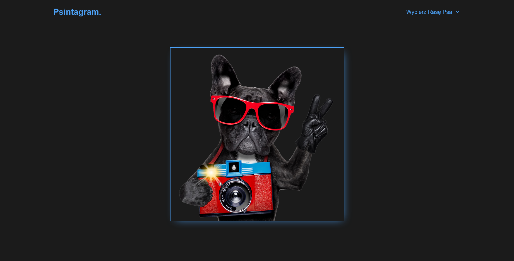
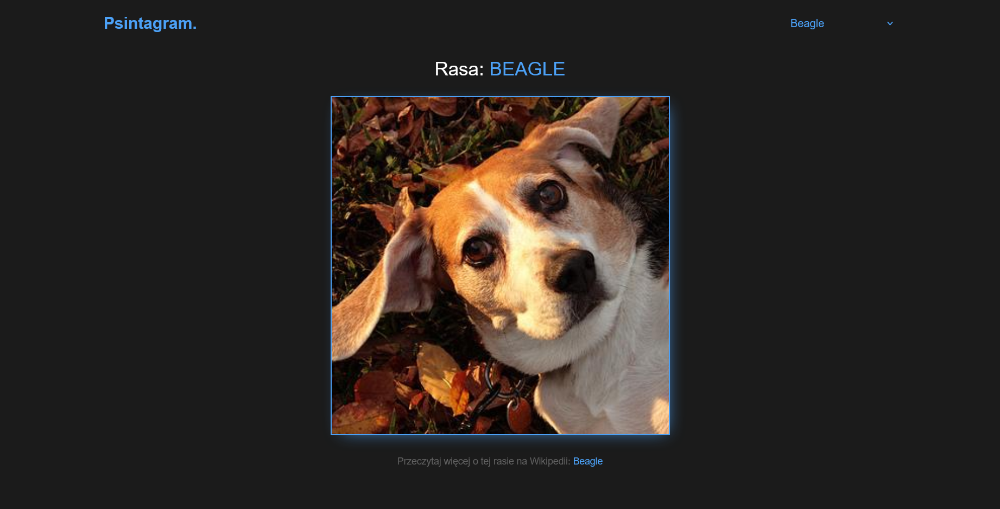

# Psintagram - website for displaying breed's photos

## ✨ Overview

Allows to view randomly selected photos of a given breed.

## 🔎 Links

Visit the website at https://psintagram-xxdbxx.netlify.app/

### 📷 Screenshots

### 🎯 Features

- API integration with https://dog.ceo
- RWD

### 💎 Pages

- Search Breed

### 🚀 Tech stack

- Angular

## 🏃‍♀️ Run locally

### Clone the project

`git clone https://github.com/dboinska/psintagram`

### Go to the project directory

`cd psintagram`

### Install dependencies

`npm install`

### Start the server

`npm start`
